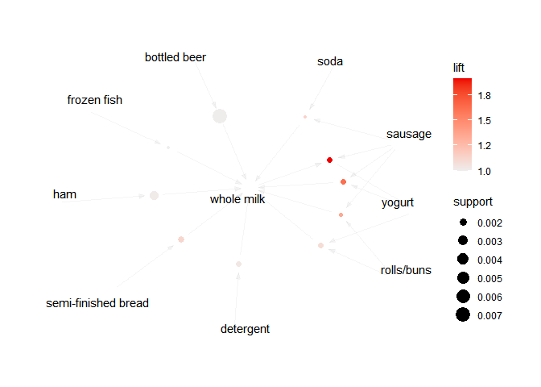

Market Basket Analysis using Apriori Algorithm
================

The objectives are to discover the most purchased products and product
combinations purchased at a grocery store. Find the dataset containing
the purchases and its respective data card used
[here](https://www.kaggle.com/datasets/heeraldedhia/groceries-dataset).

### Installing Libraries

For this project, we’ll work with these libraries:

-   arules: used for mining association rules and frequent itemsets
-   arulesViz: used for visualising mined rules and frequent itemsets
-   ggplot2: used for data visualisations
-   plyr: used for data manipulation e.g. splitting, summarising
-   dplyr: goes hand in hand with plyr to manipulate data

``` r
install.packages('arules' , repos = "http://cran.us.r-project.org")
```

    ## package 'arules' successfully unpacked and MD5 sums checked

    ## Warning: cannot remove prior installation of package 'arules'

    ## Warning in file.copy(savedcopy, lib, recursive = TRUE): problem
    ## copying ..\R-4.2.1\library\00LOCK\arules\libs\x64\arules.dll to ..
    ## \R-4.2.1\library\arules\libs\x64\arules.dll: Permission denied

    ## Warning: restored 'arules'

    ## 
    ## The downloaded binary packages are in
    ##  ...\downloaded_packages

``` r
install.packages('arulesViz', repos = "http://cran.us.r-project.org")
```

    ## package 'arulesViz' successfully unpacked and MD5 sums checked
    ## 
    ## The downloaded binary packages are in
    ##  ...\downloaded_packages

``` r
install.packages('ggplot2', repos = "http://cran.us.r-project.org")
```

    ## package 'ggplot2' successfully unpacked and MD5 sums checked
    ## 
    ## The downloaded binary packages are in
    ##  ...\downloaded_packages

``` r
install.packages('plyr', repos = "http://cran.us.r-project.org")
```

    ## package 'plyr' successfully unpacked and MD5 sums checked
    ## 
    ## The downloaded binary packages are in
    ##  ...\downloaded_packages

``` r
install.packages('dplyr', repos = "http://cran.us.r-project.org")
```

    ## package 'dplyr' successfully unpacked and MD5 sums checked

    ## Warning: cannot remove prior installation of package 'dplyr'

    ## Warning in file.copy(savedcopy, lib, recursive = TRUE): problem
    ## copying ..\R-4.2.1\library\00LOCK\dplyr\libs\x64\dplyr.dll to ..
    ## \R-4.2.1\library\dplyr\libs\x64\dplyr.dll: Permission denied

    ## Warning: restored 'dplyr'

    ## 
    ## The downloaded binary packages are in
    ##  ...\downloaded_packages

### Loading Libraries and Dataset

``` r
library(arules)
```

    ## Warning: package 'arules' was built under R version 4.2.2

    ## Loading required package: Matrix

    ## 
    ## Attaching package: 'arules'

    ## The following objects are masked from 'package:base':
    ## 
    ##     abbreviate, write

``` r
library(arulesViz)
```

    ## Warning: package 'arulesViz' was built under R version 4.2.2

``` r
library(ggplot2)
```

    ## Warning: package 'ggplot2' was built under R version 4.2.2

``` r
library(plyr)
```

    ## Warning: package 'plyr' was built under R version 4.2.2

``` r
library(dplyr)
```

    ## Warning: package 'dplyr' was built under R version 4.2.2

    ## 
    ## Attaching package: 'dplyr'

    ## The following objects are masked from 'package:plyr':
    ## 
    ##     arrange, count, desc, failwith, id, mutate, rename, summarise,
    ##     summarize

    ## The following objects are masked from 'package:arules':
    ## 
    ##     intersect, recode, setdiff, setequal, union

    ## The following objects are masked from 'package:stats':
    ## 
    ##     filter, lag

    ## The following objects are masked from 'package:base':
    ## 
    ##     intersect, setdiff, setequal, union

``` r
Groceries_dataset <- read.csv("Groceries_dataset.csv")
glimpse(Groceries_dataset)
```

    ## Rows: 38,765
    ## Columns: 3
    ## $ Member_number   <int> 1808, 2552, 2300, 1187, 3037, 4941, 4501, 3803, 2762, …
    ## $ Date            <chr> "21-07-2015", "05-01-2015", "19-09-2015", "12-12-2015"…
    ## $ itemDescription <chr> "tropical fruit", "whole milk", "pip fruit", "other ve…

These are the first 5 transactions in the dataset ordered randomly,
containing the customer number, date of purchase and description of item
bought.

### Data Preparation

There’s no need to resolve missing values since all attributes are
complete. (refer to data card on Kaggle)

Currently, the transactions are also in *single* format i.e. each row
represents a single item purchased by a customer at a particular date.
This needs to be converted to *basket* format where each row will
represent a collection of items bought by a customer at a specified
date.

To prepare the baskets/sets of transactions, first, the member number
and date of purchase will be merged into a single character-type column
`transactionId`, using `paste()`. Note, both columns need to be of type
character, therefore `Member_number` will be first transformed before
merging. After, the `Member_number` and `Date` columns can be dropped.

``` r
Groceries_dataset$transactionId <- paste(as.character(Groceries_dataset$Member_number),Groceries_dataset$Date,sep="_")
Groceries_dataset$Member_number <- NULL
Groceries_dataset$Date <- NULL
glimpse(Groceries_dataset)
```

    ## Rows: 38,765
    ## Columns: 2
    ## $ itemDescription <chr> "tropical fruit", "whole milk", "pip fruit", "other ve…
    ## $ transactionId   <chr> "1808_21-07-2015", "2552_05-01-2015", "2300_19-09-2015…

Next, the grouping of items will be done by the `ddply()` function which
will group the items by the transaction ID and set it as vectors to a
new dataframe `df1`. `df1` will then be set to the `Market_basket`
dataframe using `paste()` which converts the vectors into a rows of
characters separated by `,`. `transactionId` is then dropped and the new
column of transactions renamed.

``` r
Groceries_basket <-ddply(Groceries_dataset, c("transactionId"),function(df1)paste(df1$itemDescription,collapse = ","))
Groceries_basket$transactionId<- NULL
colnames(Groceries_basket)<-c("basketTransactions")
head(Groceries_basket)
```

    ##                              basketTransactions
    ## 1 sausage,whole milk,semi-finished bread,yogurt
    ## 2                 whole milk,pastry,salty snack
    ## 3                   canned beer,misc. beverages
    ## 4                      sausage,hygiene articles
    ## 5                       soda,pickled vegetables
    ## 6                              frankfurter,curd

Lastly, the baskets of transactions are exported to an external CSV file
for later use in generating association rules. Here the quotes and
header rows are removed.

``` r
write.csv(Groceries_basket,"groceries_basket.csv",quote = FALSE,row.names = FALSE)
```

Alternatively, the *single* format can still be applied, where items
will not be grouped per transaction. Here, each `transactionId` will be
paired to the item in a list(`singleTransactions`) from which a new
dataframe `Groceries_singles` is created. Eventually, this is written
into a CSV file for later usage and the list is deleted.

``` r
singleTransactions <- paste(as.character(Groceries_dataset$transactionId),Groceries_dataset$itemDescription,sep=";")
Groceries_singles <- data.frame(singleTransactions)
glimpse(Groceries_singles)
```

    ## Rows: 38,765
    ## Columns: 1
    ## $ singleTransactions <chr> "1808_21-07-2015;tropical fruit", "2552_05-01-2015;…

``` r
write.csv(Groceries_singles,"groceries_single.csv",quote = FALSE,row.names = FALSE)
rm(singleTransactions)
```

### Derive Best Selling Items

To generate a chart for the best sellers, the dataset is grouped
according to the item name, and the number of items per group generated.
Eventually, they are arranged in descending order. Note that `%>%` is an
operator that allows values to be piped to another function or
expression.

``` r
Best_sellers <- Groceries_dataset %>% group_by(itemDescription) %>% summarise(count=n()) %>% arrange(desc(count))
Best_sellers <- head(Best_sellers, n=15)
Best_sellers
```

    ## # A tibble: 15 × 2
    ##    itemDescription  count
    ##    <chr>            <int>
    ##  1 whole milk        2502
    ##  2 other vegetables  1898
    ##  3 rolls/buns        1716
    ##  4 soda              1514
    ##  5 yogurt            1334
    ##  6 root vegetables   1071
    ##  7 tropical fruit    1032
    ##  8 bottled water      933
    ##  9 sausage            924
    ## 10 citrus fruit       812
    ## 11 pastry             785
    ## 12 pip fruit          744
    ## 13 shopping bags      731
    ## 14 canned beer        717
    ## 15 bottled beer       687

The top 3 sellers are `whole milk`, `other vegetables` and `rolls\buns`.
These items will be visualised as follows; find more info on the
`ggplot()` functions used
[here](https://ggplot2.tidyverse.org/reference/)

``` r
Best_sellers %>% ggplot(aes(x=reorder(itemDescription,count), y=count))+ geom_bar(stat="identity", fill="purple")+coord_flip()+labs(y= "Amount", x = "Item")
```

<!-- -->

### Generate Association Rules

Before the rules are generated, the set of transactions is first
prepared through `read.transactions()` It can take either sets in basket
or single format. Be sure to uncomment which you would prefer.

``` r
# Basket transactions - the separator between items per transaction is ','
# Transactions <- read.transactions("groceries_basket.csv", format = 'basket',sep = ",")

# Single transactions - the separator between the transactionId and item is ';' 'cols' defines the two columns for separation
Transactions <- read.transactions("groceries_single.csv", format = 'single',sep = ";", cols = c(1,2))
summary(Transactions)
```

    ## transactions as itemMatrix in sparse format with
    ##  14964 rows (elements/itemsets/transactions) and
    ##  168 columns (items) and a density of 0.01511803 
    ## 
    ## most frequent items:
    ##       whole milk other vegetables       rolls/buns             soda 
    ##             2363             1827             1646             1453 
    ##           yogurt          (Other) 
    ##             1285            29432 
    ## 
    ## element (itemset/transaction) length distribution:
    ## sizes
    ##     1     2     3     4     5     6     7     8     9    10 
    ##   206 10013  2726  1273   338   179   113    96    19     1 
    ## 
    ##    Min. 1st Qu.  Median    Mean 3rd Qu.    Max. 
    ##    1.00    2.00    2.00    2.54    3.00   10.00 
    ## 
    ## includes extended item information - examples:
    ##             labels
    ## 1  1808_21-07-2015
    ## 2 abrasive cleaner
    ## 3 artif. sweetener
    ## 
    ## includes extended transaction information - examples:
    ##     transactionID
    ## 1 1000_15-03-2015
    ## 2 1000_24-06-2014
    ## 3 1000_24-07-2015

This returns more information on the transactions i.e.: - number of
transactions (14964) and number of items (168) - most frequently
purchased items which align with the chart generated above - number of
items per transaction ranging from 1 to 10, most transactions had either
2 or 3 items.

To generate the rules, the Apriori algorithm is run with a support of
0.001 and confidence of 10%. The minimum and maximum number of items per
rule is set to 2 and 5 respectively, this avoids chances of empty sets
being generated. Rules were sorted by the confidence value in descending
order.

``` r
Rules <- apriori(Transactions, parameter = list(supp=0.001, conf=0.1, minlen=2, maxlen=5))
```

    ## Apriori
    ## 
    ## Parameter specification:
    ##  confidence minval smax arem  aval originalSupport maxtime support minlen
    ##         0.1    0.1    1 none FALSE            TRUE       5   0.001      2
    ##  maxlen target  ext
    ##       5  rules TRUE
    ## 
    ## Algorithmic control:
    ##  filter tree heap memopt load sort verbose
    ##     0.1 TRUE TRUE  FALSE TRUE    2    TRUE
    ## 
    ## Absolute minimum support count: 14 
    ## 
    ## set item appearances ...[0 item(s)] done [0.00s].
    ## set transactions ...[168 item(s), 14964 transaction(s)] done [0.00s].
    ## sorting and recoding items ... [149 item(s)] done [0.00s].
    ## creating transaction tree ... done [0.00s].
    ## checking subsets of size 1 2 3 4 done [0.00s].
    ## writing ... [131 rule(s)] done [0.00s].
    ## creating S4 object  ... done [0.00s].

``` r
Rules <- sort(Rules, by='confidence', decreasing = TRUE)
options(digits=2) # rounding off to 2 d.p.
summary(Rules)
```

    ## set of 131 rules
    ## 
    ## rule length distribution (lhs + rhs):sizes
    ##   2   3 
    ## 114  17 
    ## 
    ##    Min. 1st Qu.  Median    Mean 3rd Qu.    Max. 
    ##    2.00    2.00    2.00    2.13    2.00    3.00 
    ## 
    ## summary of quality measures:
    ##     support         confidence       coverage          lift          count    
    ##  Min.   :0.0010   Min.   :0.100   Min.   :0.005   Min.   :0.65   Min.   : 15  
    ##  1st Qu.:0.0013   1st Qu.:0.110   1st Qu.:0.010   1st Qu.:0.81   1st Qu.: 20  
    ##  Median :0.0019   Median :0.122   Median :0.017   Median :0.88   Median : 29  
    ##  Mean   :0.0029   Mean   :0.126   Mean   :0.024   Mean   :0.95   Mean   : 44  
    ##  3rd Qu.:0.0038   3rd Qu.:0.135   3rd Qu.:0.032   3rd Qu.:1.03   3rd Qu.: 56  
    ##  Max.   :0.0148   Max.   :0.256   Max.   :0.122   Max.   :2.18   Max.   :222  
    ## 
    ## mining info:
    ##          data ntransactions support confidence
    ##  Transactions         14964   0.001        0.1
    ##                                                                                              call
    ##  apriori(data = Transactions, parameter = list(supp = 0.001, conf = 0.1, minlen = 2, maxlen = 5))

``` r
inspect(Rules[1:10])
```

    ##      lhs                      rhs          support confidence coverage lift
    ## [1]  {sausage, yogurt}     => {whole milk} 0.0015  0.26       0.0057   1.62
    ## [2]  {rolls/buns, sausage} => {whole milk} 0.0011  0.21       0.0053   1.35
    ## [3]  {sausage, soda}       => {whole milk} 0.0011  0.18       0.0059   1.14
    ## [4]  {semi-finished bread} => {whole milk} 0.0017  0.18       0.0095   1.11
    ## [5]  {rolls/buns, yogurt}  => {whole milk} 0.0013  0.17       0.0078   1.08
    ## [6]  {sausage, whole milk} => {yogurt}     0.0015  0.16       0.0090   1.91
    ## [7]  {detergent}           => {whole milk} 0.0014  0.16       0.0086   1.03
    ## [8]  {ham}                 => {whole milk} 0.0027  0.16       0.0171   1.01
    ## [9]  {bottled beer}        => {whole milk} 0.0072  0.16       0.0453   1.00
    ## [10] {frozen fish}         => {whole milk} 0.0011  0.16       0.0068   0.99
    ##      count
    ## [1]   22  
    ## [2]   17  
    ## [3]   16  
    ## [4]   25  
    ## [5]   20  
    ## [6]   22  
    ## [7]   21  
    ## [8]   41  
    ## [9]  107  
    ## [10]  16

131 rules were generated in total, with each having either 2 or 3 items
on either side. A summary of quality measures is also provided, find
more information about them
[here](https://mhahsler.github.io/arules/docs/measures). Looking at the
top 10 rules, an analysis can be made using the confidence values e.g. -
26% of customers who bought sausage and yoghurt also bought whole milk -
16% of customers who bought bottled beer bought whole milk

Lastly, rules regarding a particular item of interest e.g. `rolls/buns`
can be generated to find the most products most purchased together with
it. Here, items on the `lhs` are regularly purchased first then
`rolls/buns`. This info can be used by retailers in targeted
promotions/discounts and product bundling.

``` r
Rolls_rules <- apriori(Transactions, parameter = list(supp=0.001, conf=0.1), minlen=2, appearance = list(default="lhs",rhs="rolls/buns"))
```

    ## Apriori
    ## 
    ## Parameter specification:
    ##  confidence minval smax arem  aval originalSupport maxtime support minlen
    ##         0.1    0.1    1 none FALSE            TRUE       5   0.001      2
    ##  maxlen target  ext
    ##      10  rules TRUE
    ## 
    ## Algorithmic control:
    ##  filter tree heap memopt load sort verbose
    ##     0.1 TRUE TRUE  FALSE TRUE    2    TRUE
    ## 
    ## Absolute minimum support count: 14 
    ## 
    ## set item appearances ...[1 item(s)] done [0.00s].
    ## set transactions ...[168 item(s), 14964 transaction(s)] done [0.01s].
    ## sorting and recoding items ... [149 item(s)] done [0.00s].
    ## creating transaction tree ... done [0.01s].
    ## checking subsets of size 1 2 3 4 done [0.00s].
    ## writing ... [17 rule(s)] done [0.00s].
    ## creating S4 object  ... done [0.00s].

``` r
Rolls_rules <- sort(Rolls_rules, by='confidence', decreasing = TRUE)
inspect(head(Rolls_rules))
```

    ##     lhs                            rhs          support confidence coverage
    ## [1] {processed cheese}          => {rolls/buns} 0.0015  0.14       0.0102  
    ## [2] {packaged fruit/vegetables} => {rolls/buns} 0.0012  0.14       0.0085  
    ## [3] {seasonal products}         => {rolls/buns} 0.0010  0.14       0.0071  
    ## [4] {red/blush wine}            => {rolls/buns} 0.0013  0.13       0.0105  
    ## [5] {sausage, whole milk}       => {rolls/buns} 0.0011  0.13       0.0090  
    ## [6] {whole milk, yogurt}        => {rolls/buns} 0.0013  0.12       0.0112  
    ##     lift count
    ## [1] 1.3  22   
    ## [2] 1.3  18   
    ## [3] 1.3  15   
    ## [4] 1.2  20   
    ## [5] 1.2  17   
    ## [6] 1.1  20

This can also be used to answer questions like: *Customers who bought
rolls/buns also bought…*. We simply switch the order of purchasing
i.e. from `rhs` to `lhs`.

``` r
Rolls_rules <- apriori(Transactions, parameter = list(supp=0.001, conf=0.1), minlen=2, appearance = list(lhs="rolls/buns",default="rhs"))
```

    ## Apriori
    ## 
    ## Parameter specification:
    ##  confidence minval smax arem  aval originalSupport maxtime support minlen
    ##         0.1    0.1    1 none FALSE            TRUE       5   0.001      2
    ##  maxlen target  ext
    ##      10  rules TRUE
    ## 
    ## Algorithmic control:
    ##  filter tree heap memopt load sort verbose
    ##     0.1 TRUE TRUE  FALSE TRUE    2    TRUE
    ## 
    ## Absolute minimum support count: 14 
    ## 
    ## set item appearances ...[1 item(s)] done [0.00s].
    ## set transactions ...[168 item(s), 14964 transaction(s)] done [0.01s].
    ## sorting and recoding items ... [149 item(s)] done [0.00s].
    ## creating transaction tree ... done [0.01s].
    ## checking subsets of size 1 2 done [0.00s].
    ## writing ... [1 rule(s)] done [0.00s].
    ## creating S4 object  ... done [0.00s].

``` r
Rolls_rules <- sort(Rolls_rules, by='confidence', decreasing = TRUE)
inspect(head(Rolls_rules))
```

    ##     lhs             rhs          support confidence coverage lift count
    ## [1] {rolls/buns} => {whole milk} 0.014   0.13       0.11     0.8  209

### Visualising Association Rules

Lastly, a graph can be used to illustrate the top 10 rules. To make it
interactive, include the `htmlwidget` engine by adding
`engine= "htmlwidget"` as a parameter to `plot()`.

``` r
Top_rules <- head(Rules, n = 10, by = "confidence")
plot(Top_rules, method = "graph")
```

<!-- -->
